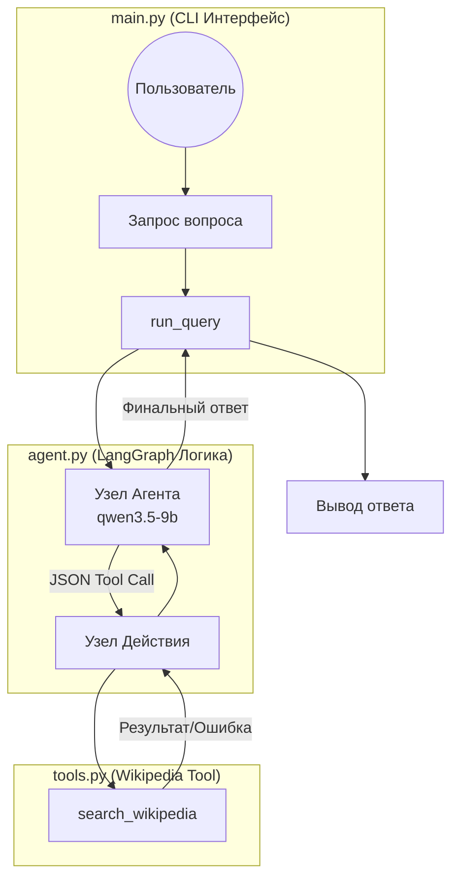

# Агент поиска по Wikipedia (LangGraph)

Минимальный цикл агента, построенный на LangGraph, который ищет информацию в Wikipedia, обрабатывает ошибки и восстанавливается, уточняя поисковые запросы.

## Архитектура

Агент следует циклическому паттерну графа:
- **Узел Агента (Agent Node)**: Использует qwen3.5-9b (через AI Tunnel) для принятия решения: выполнить поиск или предоставить итоговый ответ.
- **Узел Действия (Action Node)**: Выполняет поиск инструментом Wikipedia и обрабатывает исключения (`DisambiguationError`, `PageError`).
- **Логика восстановления**: Если инструмент возвращает ошибку, она передается обратно агенту как контекст для исправления запроса.



## Особенности

- **Надежный поиск**: Обрабатывает неоднозначные результаты, запрашивая уточнение или корректируя запрос.
- **Интеграция с AI Tunnel**: Настроен для работы через `api.aitunnel.ru` для обхода региональных ограничений.
- **Ручной вызов инструментов**: Использует надежный паттерн ручного вызова через JSON для совместимости с прокси.
- **Детальные Docstrings**: Инструменты документированы максимально подробно для точного следования инструкциям моделью (принцип "капризного сотрудника").

## Установка

1. Создайте виртуальное окружение:
   ```bash
   python -m venv venv
   source venv/bin/activate  # Windows: venv\\Scripts\\activate
   ```

2. Установите зависимости:
   ```bash
   pip install -r requirements.txt
   ```

3. Создайте файл `.env` на основе `.env.template` и добавьте ваш `OPENAI_API_KEY`.

4. Запустите демонстрацию:
   ```bash
   python main.py
   ```

## Требования
- `langchain-openai`
- `langgraph`
- `wikipedia`
- `python-dotenv`
