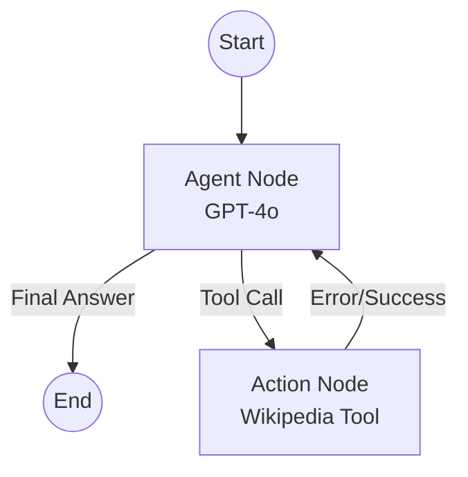

# Wikipedia Search Agent (LangGraph)

Minimal agent cycle built with LangGraph that searches Wikipedia, handles errors, and recovers by refining queries.

## Architecture

The agent follows a cyclic graph pattern:
- **Agent Node**: Uses GPT-4o (via AI Tunnel) to decide whether to search or provide a final answer.
- **Action Node**: Executes the Wikipedia tool and handles exceptions (`DisambiguationError`, `PageError`).
- **Recovery Logic**: If a tool returns an error, it is fed back into the agent as context for correction.



## Features

- **Robust Search**: Handles ambiguous results by asking for clarification or refining the query.
- **AI Tunnel Integration**: Configured to work through `api.aitunnel.ru` to bypass regional restrictions.
- **Manual Tool Calling**: Uses a reliable JSON-based manual calling pattern for compatibility.
- **Detailed Docstrings**: Tools are documented like "capricious employee instructions" for precise LLM behavior.

## Setup

1. Create a virtual environment:
   ```bash
   python -m venv venv
   source venv/bin/activate  # Windows: venv\\Scripts\\activate
   ```

2. Install dependencies:
   ```bash
   pip install -r requirements.txt
   ```

3. Create a `.env` file from `.env.template` and add your `OPENAI_API_KEY`.

4. Run the demonstration:
   ```bash
   python main.py
   ```

## Requirements
- `langchain-openai`
- `langgraph`
- `wikipedia`
- `python-dotenv`
